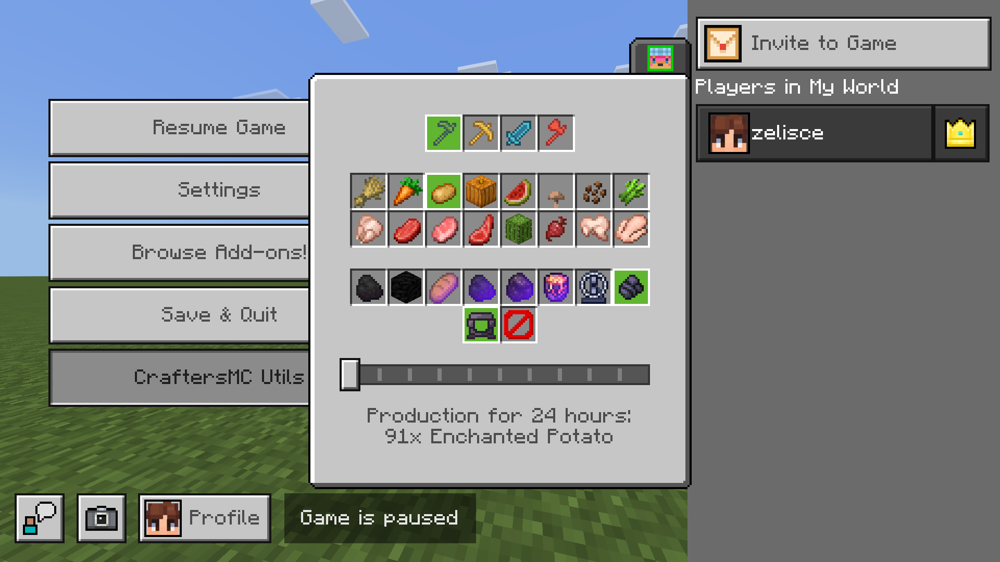

  

<h3>CraftersMC Utils</h3>

  Passionate resource pack with tools to enhance the gameplay at CraftersMC

<h2>📖 Introduction</h1>
Were you ever tired of searching through the discord or web for the tools you need? 
Do you maybe use a phone and cannot use your tools without leaving your game?  
CraftersMC Utils is a resource pack that includes tools that aim to enhance your CraftersMC gameplay without the need to leave the server at all!  
If you found this project helpful and you liked it, please leave a star, it would mean a ton!

<h2>🛠️ Download</h2>
Install the latest `.mcpack` version from <a href="https://github.com/zelisce/CraftersMC-Minion-Calculator/releases/latest">releases</a>.  
After installing the latest version, open the file using Minecraft. It will import itself automatically afterwards.

<h2>🎯 Features</h1>
• Minion Calculator  

<h2>🙌 Credits</h1>
Special thanks to:  
» Peawies, for his idea and minion production data! 
» And <a href="https://github.com/ya-rifat">@ya-rifat</a> for his brilliant idea on how to efficiently code the Minion Calculator!
